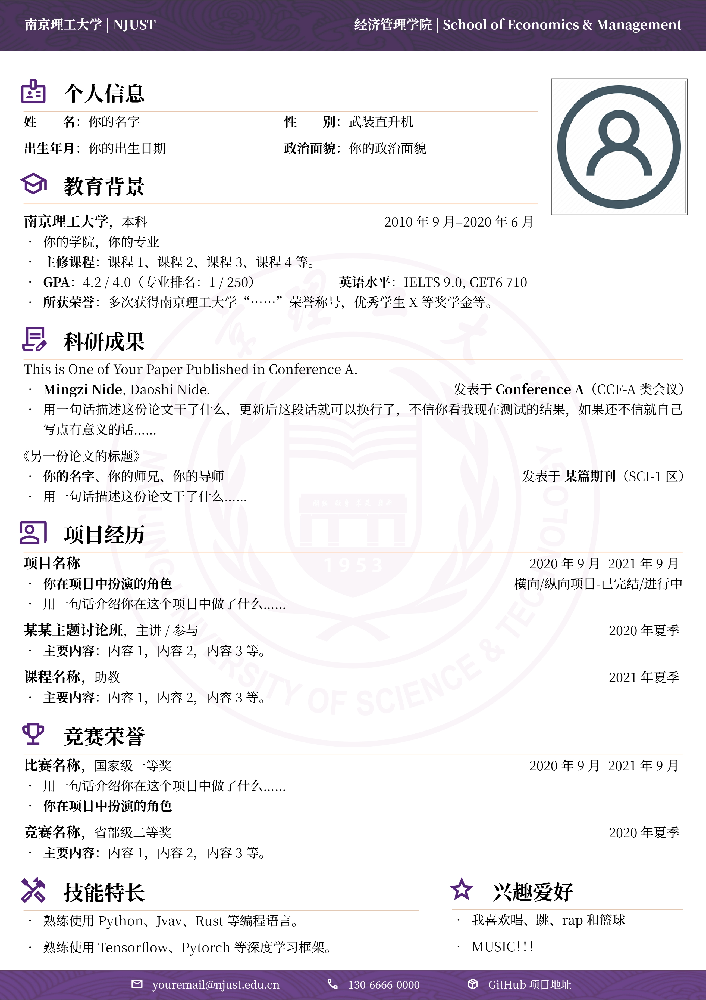

# NJUST-CV：南京理工大学 LaTeX 中文简历模板

## 简介

本模板基于：

- [WHU 中文 CV 模板](https://www.overleaf.com/latex/templates/whuwu-han-da-xue-zhong-wen-jian-li-mo-ban/dbkvxrqjmzpd)
- [NPU 中文 CV 模板](https://www.overleaf.com/latex/templates/npu-cv/mncqzxhvfzrx)
- [SEU 中文 CV 模板](https://github.com/Exception0x0194/SEU-CV)

在原有内容的基础上进行了修改：

- 更改了照片和个人信息栏位的相对位置
- 更改了校徽图标
- 更改了配色
- 更改了页边距
- 加入了竞赛经历section
- 修改默认性别`沃尔玛购物袋`为`武装直升机`

> [!WARNING]
> 请注意，本模板在提供了在header（简历左上方）中显示白色南京理工大学校徽的代码，但因为技术原因已被注释。
> 
>被注释掉的原因是由于南京理工大学校徽的设计原因，logo中心带有白色镌刻文字的二道门，在尝试将整个图片颜色取为白色背景的过程中，几乎不可能做到保留二道门上的完全文字图像。因此，在本仓库中的`banner-white.png`图像中的南理工logo与原设有明显区别，请谨慎使用。
> 
>你可以自行决定采用哪一种表现方法，本仓库不对该决定带来的任何结果负责。

## 使用方法

- 编辑 `main.tex` 中的内容，对文档样式和内容进行修改。
- 使用 `XeLaTeX` 或 `LuaLaTeX` 编译。
- 使用 [overleaf平台](www.overleaf.com) 导入本仓库并进行在线编译，实时预览并下载最终PDF文档结果。

## 友情链接

- [南京理工大学 · 课程攻略共享计划](https://github.com/NJUST-OpenLib/NJUST-docs)
- [南京理工大学 · 开放知识库](https://github.com/NJUST-OpenLib/NJUST-OpenLib)
- 对于有紧凑排版需求的同学可以从这里找想要的模板：[适合中文的简历模板awesome-resume-for-chinese](https://github.com/dyweb/awesome-resume-for-chinese)
